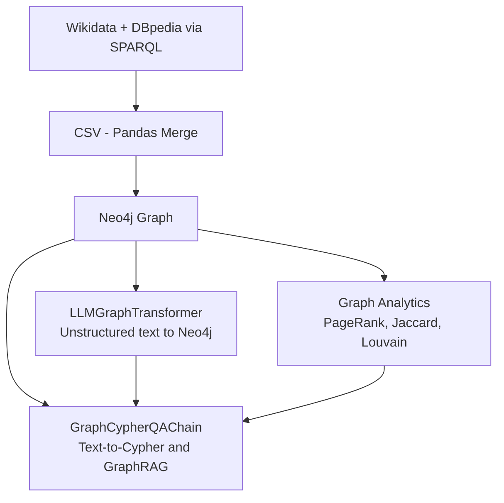

# Geopolitical Knowledge Graph: Analysis with Neo4j, Wikidata & DBpedia

## Deskripsi Proyek

Proyek ini membangun knowledge graph geopolitik dengan mengintegrasikan data dari Wikidata dan DBpedia (kota, negara, benua, bahasa, mata uang) ke dalam Neo4j. Graph dianalisis menggunakan algoritma Graph Data Science (PageRank, Jaccard Similarity, Louvain Community Detection), serta diperkaya dengan komponen AI berbasis LangChain: Text-to-Cypher, LLM Graph Builder, dan GraphRAG.

## Arsitektur



## Komponen

### 1. Data & Graph Schema
- **Node labels**: City, Country, Continent, Language, Currency
- **Relationships**: `BELONGS_TO`, `PART_OF`, `SPEAKS`, `USES_CURRENCY`
- Dataset: 250+ baris, mencakup 5 entitas, hasil integrasi Wikidata + DBpedia via SPARQL

### 2. Graph Analytics (Neo4j GDS)
- **PageRank**: mengukur dominasi struktural bahasa dalam jaringan
- **Jaccard Similarity**: mengukur kemiripan profil geopolitik antar negara
- **Louvain Community Detection**: mendeteksi blok/komunitas regional secara otomatis

### 3. LLM Text-to-Cypher & GraphRAG
Menggunakan `GraphCypherQAChain` dari LangChain. Chain ini secara otomatis:
1. Membaca schema graph via `graph.refresh_schema()`
2. Menerjemahkan pertanyaan bahasa natural menjadi query Cypher
3. Mengeksekusi query ke Neo4j
4. Menghasilkan jawaban natural language berdasarkan hasil query

### 4. LLM Graph Builder
Menggunakan `LLMGraphTransformer` untuk mengekstrak entitas dan relasi dari teks tidak terstruktur (contoh: artikel berita geopolitik). Ekstraksi dibatasi menggunakan `allowed_nodes` dan `allowed_relationships` agar hasil tetap konsisten dengan schema graph, kemudian ditambahkan ke Neo4j via `graph.add_graph_documents()`.

## Instalasi & Konfigurasi

### Requirements
```bash
pip install langchain langchain-openai langchain-neo4j langchain-experimental
```

### Environment Setup
```python
import os

os.environ["NEO4J_URI"] = "bolt+s://<your-instance>.neo4jsandbox.com:443"
os.environ["NEO4J_USERNAME"] = "neo4j"
os.environ["NEO4J_PASSWORD"] = "<your-password>"
os.environ["OPENROUTER_API_KEY"] = "<your-api-key>"
```

> Catatan: Jangan commit API key/password ke repository. Gunakan environment variable atau file `.env`.

### Cara Menjalankan
1. Buka `notebook.ipynb` di Google Colab
2. Jalankan cell instalasi library
3. Isi kredensial Neo4j dan OpenRouter pada cell konfigurasi
4. Jalankan seluruh cell secara berurutan (Run All)

## Logika Cypher & Pipeline AI

### GraphCypherQAChain (Text-to-Cypher + GraphRAG)
Chain ini diinisialisasi dengan `graph` (koneksi Neo4j) dan `llm` (model via OpenRouter). Saat menerima pertanyaan, chain secara otomatis menghasilkan Cypher query (`cypher_llm`), mengeksekusinya, lalu memformulasikan jawaban natural language (`qa_llm`) berdasarkan hasil query — tanpa perlu menulis prompt schema secara manual karena schema dibaca otomatis dari Neo4j.

### LLMGraphTransformer (Graph Builder)
Teks tidak terstruktur diubah menjadi `Document`, kemudian diproses oleh `LLMGraphTransformer` yang dikonfigurasi dengan `allowed_nodes` (Country, City, Organization, Currency, Region) dan `allowed_relationships` (MEMBER_OF, CAPITAL_OF, LOCATED_IN, TRADES_WITH, USES_CURRENCY). Hasil ekstraksi berupa graph documents yang langsung dapat ditambahkan ke Neo4j.

## Penggunaan AI dalam Pengembangan

Proyek ini dikembangkan dengan bantuan AI assistant (Claude, Anthropic) untuk:
- Merancang arsitektur pipeline berbasis LangChain
- Menyesuaikan konfigurasi koneksi Neo4j dan OpenRouter
- Menulis dokumentasi README ini

**Model LLM yang digunakan dalam pipeline**: `qwen/qwen-2.5-72b-instruct` via OpenRouter

**Modifikasi manual**: Penyesuaian kredensial koneksi (Neo4j Sandbox URI, OpenRouter API key) agar sesuai dengan instance dan dataset milik kelompok ini, pengujian query dengan berbagai pertanyaan.

## Dataset & Sumber

- Wikidata SPARQL endpoint: https://query.wikidata.org/
- DBpedia SPARQL endpoint: https://dbpedia.org/sparql
- Dataset hasil integrasi: `Geopolitik Dataset - Graf.csv`

## Tim
- Khalila Shafarayhani Atletiko - 5026231167
- Alisha Rafimalia - 5026231202
